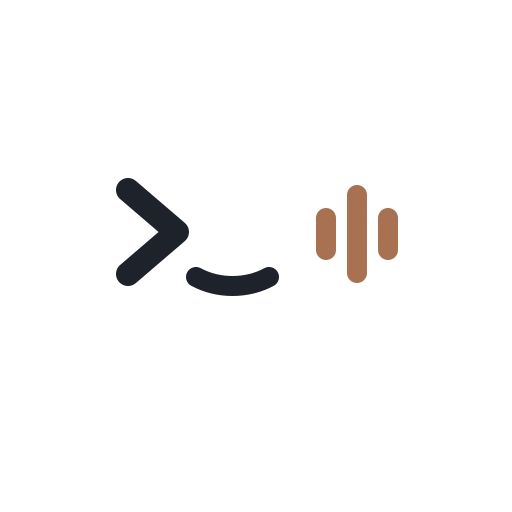
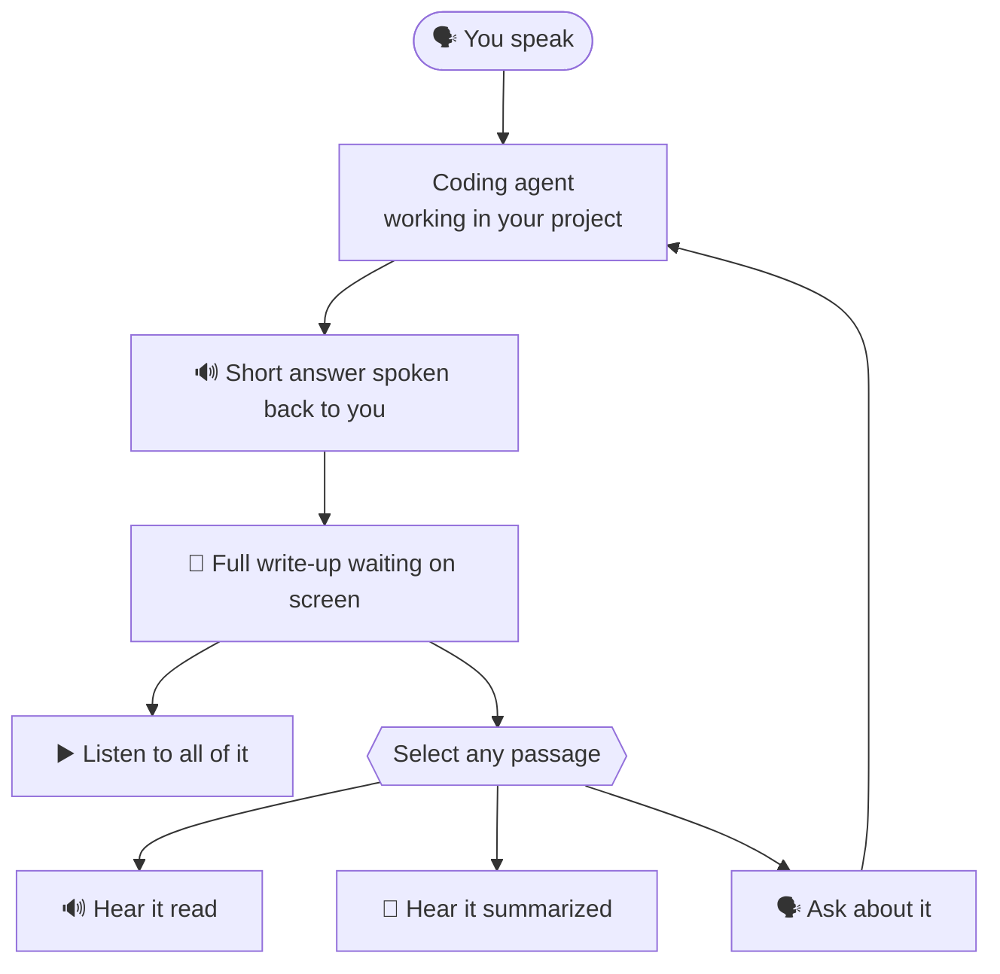

<p align="center"></p>

# nutshell

Ask a coding agent something and it hands you a wall of text. You read it,
you type again, you read again. Every tool we have talks to us in one
channel — text, text and more text — so the whole conversation stays on the
keyboard, even the half of it that could have been a sentence said out loud.

nutshell puts a voice in front of one. Say what you need — a question, a
task, a piece of research — and the reply comes back *in a nutshell*: two or
three spoken sentences, while the agent does the work in your project. The
full write-up is not read at you; it waits on screen. Open it, and you can
hand any part of it back: select a passage to hear it read, to hear it
summarized, or to ask about it — and the whole thing has a player, so you
can listen to all of it while you do something else.

nutshell starts a coding agent (Claude Code today) in the current directory,
opens a small web UI on a random local port, and wires it to speech-to-text
and text-to-speech through OpenRouter.



## Install

On Linux or macOS:

```sh
curl -fsSL https://github.com/mhrlife/nutshell/releases/latest/download/install.sh | bash
```

On Windows, in PowerShell:

```powershell
irm https://github.com/mhrlife/nutshell/releases/latest/download/install.ps1 | iex
```

The script picks the build for your machine, checks it against
`checksums.txt`, and puts `nutshell` on your `PATH`.

Two more things before the first run:

1. The agent's CLI has to be on your `PATH` — `claude` for Claude Code.
2. Set an OpenRouter key. Speech-to-text and text-to-speech both run through
   OpenRouter, so that key is what makes voice work:

   ```sh
   export OPENROUTER_API_KEY=sk-or-...
   ```

   Without it the UI still works with typed messages; voice is switched off.

## Run

```sh
cd your-project
nutshell
```

A browser tab opens on `http://127.0.0.1:<random port>`. Every nutshell you
start picks its own port, so several projects can run side by side.

Anything nutshell does not recognise is forwarded to the agent unchanged:

```sh
nutshell --model opus --mcp-config mcp.json --permission-mode acceptEdits
```

nutshell's own flags:

| Flag | Default | Meaning |
| --- | --- | --- |
| `--port` | `0` (random) | Port for the web UI |
| `--no-open` | | Don't open the browser |
| `--lang` | `en` | Default UI language (`en` or `fa`) |
| `--agent` | `claude` | Which agent to drive |
| `--agent-bin` | | Path to the agent executable |
| `--openrouter-key` | `$OPENROUTER_API_KEY` | OpenRouter API key |
| `--stt-model` | `google/gemini-3.8-flash` | Speech-to-text model (a chat model with audio input) |
| `--summary-model` | `google/gemini-3.8-flash` | Summarizes a selected passage before it is read aloud |
| `--tts-model` | `x-ai/grok-voice-tts-1.0` | Text-to-speech model |
| `--tts-voice` | `leo` | Voice for the speech model (Grok: `eve`, `ara`, `rex`, `sal`, `leo`) |
| `--tts-speed` | `1.2` | How fast the voice talks; `1` is the model's own pace (Grok accepts `0.7`–`1.5`) |
| `--tts-prompt` | `none` | Delivery instructions placed before the spoken text, for voices that follow them (Gemini TTS does; Grok reads them aloud): `none`, the built-in calm `lecture` style, or literal text |
| `--debug` | | Log every API call, turn and OpenRouter request (`--verbose` stays the agent's own flag) |
