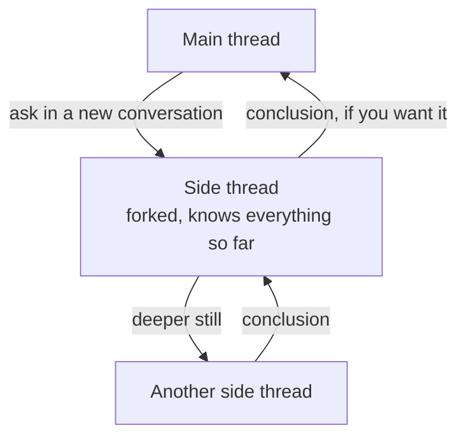

<p align="center"></p>

# nutshell

Ask a coding agent something and it hands you a wall of text. You read it,
you type again, you read again. Every tool we have talks to us in one
channel — text, text and more text — so the whole conversation stays on the
keyboard, even the half of it that could have been a sentence said out loud.

nutshell puts a voice in front of one. Say what you need — a question, a
task, a piece of research — and the reply comes back *in a nutshell*: two or
three spoken sentences, while the agent does the work in your project. The
full write-up is not read at you; it waits on screen. Open it, and you can
hand any part of it back: select a passage to hear it read, to hear it
summarized, to ask about it, or to ask about it somewhere else entirely (see
[side threads](#side-threads)) — and the whole thing has a player, so you can
listen to all of it while you do something else.

nutshell starts a coding agent (Claude Code today) in the current directory,
opens a small web UI on a local port, and wires it to speech-to-text
and text-to-speech through OpenRouter, or any other API that speaks the
OpenAI interface (see [configuration](#configuration)).


## Install

On Linux or macOS:

```sh
curl -fsSL https://github.com/mhrlife/nutshell/releases/latest/download/install.sh | bash
```

On Windows, in PowerShell:

```powershell
irm https://github.com/mhrlife/nutshell/releases/latest/download/install.ps1 | iex
```

The script picks the build for your machine, checks it against
`checksums.txt`, and puts `nutshell` on your `PATH`.

Two more things before the first run:

1. The agent's CLI has to be on your `PATH` — `claude` for Claude Code.
2. Give nutshell an OpenRouter key. Speech-to-text and text-to-speech both
   run through OpenRouter by default, so that key is what makes voice work.
   Put it in the [configuration file](#configuration):

   ```json
   { "providers": { "openrouter": { "api_key": "sk-or-..." } } }
   ```

   or, as a fallback, in the environment: `export OPENROUTER_API_KEY=sk-or-...`.
   Without a key the UI still works with typed messages; voice is switched off.

## Behind a wrapper CLI

Not everyone starts `claude` directly. A team may have a host CLI that
configures a Claude Code session first — a system prompt, an MCP set, a
sandbox — and starts the CLI itself. `--agent claude-wrapper` drives Claude
Code through such a host:

```sh
nutshell --agent claude-wrapper --agent-bin "divar-copilot agent"
```

What a host has to do for this to work:

- render `-p`, `--input-format stream-json`, `--output-format stream-json` and
  `--verbose` itself, so nutshell does not pass them a second time;
- accept `--resume <id>` among its own flags, ahead of a `--` separator: the
  host is what resolves the session's working directory from that id;
- forward everything after `--` to Claude Code unchanged, so nutshell can still
  pass `--append-system-prompt`, `--permission-prompt-tool` and your own flags.

## Run

```sh
cd your-project
nutshell
```

A browser tab opens on `http://127.0.0.1:4700`, or on the next free port after
it when 4700 is taken, so several projects can run side by side. Starting from
the same port each time is what lets the browser remember the microphone
permission instead of asking again on every run. Only when 4700–4799 are all
taken does nutshell fall back to a random port.

Anything nutshell does not recognise is forwarded to the agent unchanged:

```sh
nutshell --model opus --mcp-config mcp.json --permission-mode acceptEdits
```

nutshell's own flags override the matching entry of the
[configuration file](#configuration) for one run:

| Flag | Default | Meaning |
| --- | --- | --- |
| `--config` | `<user config dir>/nutshell/config.json` | Configuration file to read |
| `--port` | `0` (first free from 4700) | Port for the web UI |
| `--no-open` | | Don't open the browser |
| `--lang` | `en` | Default UI language (`en` or `fa`) |
| `--agent` | `claude` | Which agent to drive: `claude`, or `claude-wrapper` for a host CLI that starts Claude Code for us |
| `--agent-bin` | | Path to the agent executable; for `claude-wrapper`, the host command and its subcommand |
| `--stt-model` | `google/gemini-3.8-flash` | Speech-to-text model (a chat model with audio input) |
| `--summary-model` | `google/gemini-3.8-flash` | Summarizes a selected passage before it is read aloud |
| `--tts-model` | `google/gemini-3.1-flash-tts-preview` | Text-to-speech model |
| `--tts-voice` | `Charon` | Voice for the speech model (Gemini TTS: `Charon`, `Zephyr`, `Puck`, `Kore`, `Fenrir`, `Leda`, `Orus`, `Aoede`) |
| `--tts-prompt` | `dry` | Director's note placed before the spoken text, for voices that follow one (Gemini TTS does): the built-in flat, fast `dry` style, `none`, or literal text |
| `--debug` | | Log every API call, turn and speech request (`--verbose` stays the agent's own flag) |

## Configuration

nutshell reads `config.json` from its folder in the user config directory:
`~/.config/nutshell/config.json` on Linux, `~/Library/Application Support/nutshell/config.json`
on macOS, `%AppData%\nutshell\config.json` on Windows (`--config` points
elsewhere). Not sure which one applies? `nutshell config path` prints it:

```sh
nutshell config path
$EDITOR "$(nutshell config path)"
```
 Every field is optional — whatever the file leaves out keeps the
default below — and a key nutshell does not know is an error, so a typo does
not go unnoticed. Since the file can hold API keys, keep it `chmod 600`.

```json
{
  "port": 0,
  "open_browser": true,
  "debug": false,
  "lang": "en",
  "agent": { "name": "claude", "bin": "", "args": [] },
  "providers": {
    "openrouter": {
      "interface": "openai",
      "base_url": "https://openrouter.ai/api/v1",
      "api_key": "",
      "api_key_env": "OPENROUTER_API_KEY"
    },
    "gemini": {
      "interface": "gemini",
      "base_url": "https://generativelanguage.googleapis.com/v1beta",
      "api_key": "",
      "api_key_env": "GEMINI_API_KEY"
    }
  },
  "stt": { "provider": "openrouter", "model": "google/gemini-3.8-flash", "transcription": "" },
  "summary": { "provider": "openrouter", "model": "google/gemini-3.8-flash" },
  "tts": {
    "provider": "openrouter",
    "model": "google/gemini-3.1-flash-tts-preview",
    "voice": "Charon",
    "style": "dry",
    "api": "speech"
  }
}
```

- `providers` are the APIs speech runs through, by name. `interface` is the
  API they speak: `openai` (`/chat/completions` and `/audio/speech`) or
  `gemini` (Gemini's own `models/{model}:generateContent`, with speech
  streamed from `:streamGenerateContent`). A provider's key is `api_key`, or
  when that is empty the environment variable named by `api_key_env`. The
  built-in `openrouter` and `gemini` entries only need what you change,
  usually just `api_key`; a provider of your own defaults to `openai`.
- `stt`, `summary` and `tts` each pick a provider and a model, so the three
  can run on different APIs. `stt` and `summary` need a chat model (`stt` one
  that takes audio input); `tts` needs a model that returns 24 kHz 16-bit PCM
  (on Gemini, a TTS model from 3.1 on, which can stream).
- `stt.transcription` is the mode of a Gemini transcription model such as
  `gemini-3.5-transcribe`, which is sent the recording alone. `smart` is what
  a model with `transcribe` in its name runs when this is left empty: it
  drops fillers and false starts and resolves self-corrections ("open
  config.go, no, main.go" comes out as "open main.go"), and keeps code terms
  in Latin letters. `verbatim` keeps every word, and in testing spelled code
  terms out in Persian letters (`مین دات گو` for `main.go`). Any other model
  is a chat model, sent instructions with the recording.
- `tts.style` is the director's note: `dry`, `none`, or literal text.
- `tts.api` is the route an `openai` provider serves the TTS model on:
  `speech` (`/audio/speech`, the default) or `chat` (`/chat/completions` with
  audio output). LiteLLM serves Gemini's TTS models only on `chat`, and
  returns each piece of a clip whole instead of streaming it, so the first
  words take a little longer to start.
- `agent.args` go to the agent ahead of any flags forwarded from the command line.

For example, to read answers aloud with OpenAI while transcription stays on
OpenRouter:

```json
{
  "providers": {
    "openrouter": { "api_key": "sk-or-..." },
    "openai": { "base_url": "https://api.openai.com/v1", "api_key_env": "OPENAI_API_KEY" }
  },
  "tts": { "provider": "openai", "model": "gpt-4o-mini-tts", "voice": "alloy", "style": "none" }
}
```

Everything through a LiteLLM proxy, with Gemini models behind it:

```json
{
  "providers": {
    "litellm": { "base_url": "https://litellm.example.com/v1", "api_key_env": "LITELLM_API_KEY" }
  },
  "stt": { "provider": "litellm", "model": "gemini-3.8-flash" },
  "summary": { "provider": "litellm", "model": "gemini-3.8-flash" },
  "tts": { "provider": "litellm", "model": "gemini-3.1-flash-tts-preview", "api": "chat" }
}
```

Everything on Gemini's own API instead:

```json
{
  "providers": { "gemini": { "api_key": "AIza..." } },
  "stt": { "provider": "gemini", "model": "gemini-3.5-transcribe", "transcription": "smart" },
  "summary": { "provider": "gemini", "model": "gemini-3.8-flash" },
  "tts": { "provider": "gemini", "model": "gemini-3.1-flash-tts-preview", "voice": "Algenib" }
}
```

Only OpenRouter reports what a call cost; Gemini reports tokens, not a price,
so with other providers the cost shown in the UI leaves those calls out.

## Side threads

One answer often raises three questions of its own. Asking them where you are
buries the thread you were following, so nutshell lets a question go off on
its own: select the term you are wondering about and pick **ask in a new
conversation**, or arm the branch button next to the input (`b`) and ask.

That opens a side thread. It starts out knowing everything said so far — it
forks the agent's session, rather than starting from nothing — but nothing
asked in it ever reaches the conversation it came from. Side threads can be
opened from side threads, as deep as you like; the trail at the top says where
you are, and a line in the thread above marks where each one was opened.

When you are done, **got what I needed** asks the side thread to sum up what
it settled and takes that one paragraph back with it, where it rides along
with your next question as something the agent already knows. **Just leave
it** closes the thread and carries nothing.


